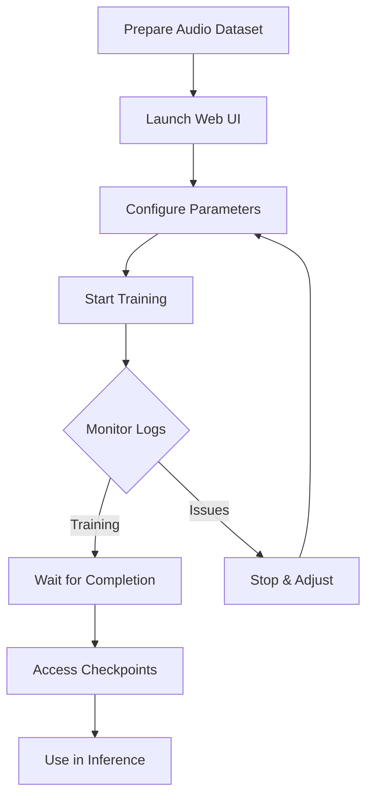

# Seed-VC V2 Training Web UI Guide

## Overview

The `app_train_v2.py` provides a user-friendly web interface for training custom Seed-VC V2 models without using command-line tools.

## Features

✅ **Easy-to-use web interface** - No command-line experience needed
✅ **Real-time log monitoring** - Watch training progress live
✅ **Checkpoint management** - View and manage saved models
✅ **Training control** - Start/stop training from the browser
✅ **Multi-model support** - Train CFM and/or AR models
✅ **Pretrained model support** - Continue training from existing checkpoints

---

## Installation

No additional installation required! If you can run `train_v2.py`, you can use this UI.

---

## Quick Start

### 1. Launch the Web UI

```bash
python app_train_v2.py
```

The interface will open at: **http://localhost:7860**

### 2. Prepare Your Dataset

Collect audio files and place them in a directory:

```
my_dataset/
├── audio1.wav
├── audio2.wav
├── audio3.mp3
└── ...
```

**Supported formats:** wav, flac, mp3, m4a, opus, ogg
**Recommended:** 1-30 seconds per file, 5-10 minutes total

### 3. Configure Training

In the **Training** tab:

1. **Dataset Directory:** Enter the path to your audio folder
2. **Run Name:** Choose a name for this training run (e.g., "my_voice_v1")
3. **Batch Size:** Start with 2 (increase if you have more GPU memory)
4. **Max Steps:** Set to 1000 or more (100 minimum for testing)
5. **Train CFM:** Check this box (recommended)
6. **Train AR:** Optional (for advanced style transfer)

### 4. Start Training

Click the **▶️ Start Training** button and monitor the real-time logs.

### 5. Monitor Progress

- **Status box:** Shows current training state
- **Logs box:** Displays real-time training output
- Watch for loss values decreasing over time

### 6. Access Your Model

After training, find your checkpoints in the **Checkpoints** tab or at:

```
runs/<run_name>/
├── CFM_epoch_00000_step_01000.pth
└── AR_epoch_00000_step_01000.pth
```

---

## Interface Guide

### Training Tab

#### Dataset Configuration

| Field | Description | Example |
|-------|-------------|---------|
| **Dataset Directory** | Path to audio files | `/home/user/my_dataset` |
| **Run Name** | Name for this training run | `my_custom_voice` |

#### Training Parameters

| Parameter | Range | Default | Description |
|-----------|-------|---------|-------------|
| **Batch Size** | 1-16 | 2 | Number of samples per batch (higher = more memory) |
| **Num Workers** | 0-8 | 0 | Data loading threads (set 0 on Windows) |
| **Max Steps** | 1+ | 1000 | Maximum training steps |
| **Max Epochs** | 1+ | 1000 | Maximum training epochs |
| **Save Every** | 1+ | 500 | Checkpoint save interval (in steps) |

#### Model Selection

- **Train CFM:** Conditional Flow Matching model (recommended for voice conversion)
- **Train AR:** Autoregressive model (optional, for style/accent transfer)

You can train both simultaneously!

#### Pretrained Checkpoints (Optional)

| Field | Description |
|-------|-------------|
| **Config Path** | Model configuration file (default: `configs/v2/vc_wrapper.yaml`) |
| **Pretrained CFM Checkpoint** | Continue training from existing CFM model |
| **Pretrained AR Checkpoint** | Continue training from existing AR model |

Leave blank to start from scratch.

#### Training Monitor

- **Status:** Shows if training is running, completed, or stopped
- **Training Logs:** Real-time output from the training process

### Checkpoints Tab

View all saved model checkpoints organized by training run.

1. Click **🔄 Refresh List** to update
2. Select a run from the dropdown
3. View CFM and AR checkpoint files

### Help Tab

Comprehensive guide with:
- Quick start instructions
- Training tips and best practices
- Output file locations
- How to use trained models
- Troubleshooting

---

## Training Workflow



---

## Best Practices

### Dataset Preparation

✅ **DO:**
- Use clean, high-quality audio
- Include variety (different sentences/contexts)
- 5-10 minutes of audio recommended
- Keep consistent speaker/style

❌ **DON'T:**
- Use noisy or low-quality audio
- Mix multiple speakers (unless intentional)
- Use only one short clip

### Training Parameters

| GPU Memory | Batch Size | Expected Speed |
|------------|------------|----------------|
| 6GB | 1-2 | Slow |
| 8GB | 2-4 | Medium |
| 12GB | 4-8 | Fast |
| 16GB+ | 8-16 | Very Fast |

**Training Time Examples (on T4 GPU):**
- 100 steps: ~2 minutes
- 500 steps: ~10 minutes
- 1000 steps: ~20 minutes

### When to Stop Training

Monitor the logs for these indicators:

✅ **Good signs:**
- Loss steadily decreasing
- No "nan" or "inf" values
- Regular checkpoint saves

⚠️ **Warning signs:**
- Loss stops decreasing (may need more steps)
- Loss increases rapidly (reduce learning rate)
- Out of memory errors (reduce batch size)

---

## Using Trained Models

### CLI Inference

```bash
python inference_v2.py \
  --cfm-checkpoint-path runs/my_run/CFM_epoch_00000_step_01000.pth \
  --ar-checkpoint-path runs/my_run/AR_epoch_00000_step_01000.pth \
  --source source.wav \
  --target reference.wav \
  --output ./output \
  --diffusion-steps 50
```

### Web UI Inference

```bash
python app_vc_v2.py \
  --cfm-checkpoint-path runs/my_run/CFM_epoch_00000_step_01000.pth \
  --ar-checkpoint-path runs/my_run/AR_epoch_00000_step_01000.pth \
  --compile
```

Then open http://localhost:7860 and upload your audio files.

---

## Troubleshooting

### Problem: Out of Memory Error

**Solution:**
1. Reduce batch size to 1
2. Close other applications
3. Use a smaller model config

### Problem: Training is Very Slow

**Solution:**
1. Check GPU is being used (check logs for "cuda" device)
2. Reduce num_workers to 0
3. Use a smaller dataset for testing

### Problem: Cannot Stop Training

**Solution:**
1. Click **Stop Training** button
2. Wait 10 seconds
3. If still running, refresh the page
4. Check terminal for the process and kill manually if needed

### Problem: No Checkpoints Saved

**Solution:**
1. Check disk space
2. Verify write permissions for `runs/` directory
3. Ensure training ran for at least `save_every` steps
4. Check logs for error messages

### Problem: Loss is NaN or Inf

**Solution:**
1. Reduce learning rate (modify config file)
2. Check dataset for corrupted audio
3. Reduce batch size
4. Start from pretrained checkpoint

---

## Advanced Usage

### Multi-GPU Training

The training UI uses `accelerate launch` which supports multi-GPU out of the box.

Configure accelerate first:

```bash
accelerate config
```

Then launch the UI normally - it will automatically use your accelerate configuration.

### Custom Model Architectures

1. Create a custom config file in `configs/v2/`
2. In the UI, set **Config Path** to your custom config
3. Start training

### Resume Training

To continue training from a previous run:

1. Set **Pretrained CFM Checkpoint** to: `runs/previous_run/CFM_epoch_*_step_*.pth`
2. Set **Pretrained AR Checkpoint** to: `runs/previous_run/AR_epoch_*_step_*.pth`
3. Use a **different Run Name** to avoid overwriting
4. Start training

---

## Comparison: CLI vs Web UI

| Feature | CLI (`train_v2.py`) | Web UI (`app_train_v2.py`) |
|---------|---------------------|----------------------------|
| **Ease of Use** | ⭐⭐ | ⭐⭐⭐⭐⭐ |
| **Real-time Logs** | Terminal only | Browser + formatted |
| **Checkpoint View** | Manual file browsing | Built-in viewer |
| **Stop Training** | Ctrl+C | Button click |
| **Multi-GPU** | ✅ Yes | ✅ Yes |
| **Remote Access** | SSH required | Web browser |
| **Automation** | ✅ Easy | ⚠️ Manual |

**Use CLI when:**
- Running automated training pipelines
- Training via SSH without GUI
- Using shell scripts

**Use Web UI when:**
- Learning to train models
- Want visual feedback
- Prefer graphical interface
- Need to monitor remotely via browser

---

## FAQ

**Q: Can I train V1 models with this UI?**
A: No, this UI is specifically for V2 models. Use the CLI `train.py` for V1 models.

**Q: How much data do I need?**
A: Minimum 1 utterance, but 5-10 minutes recommended for best results.

**Q: Can I use CPU instead of GPU?**
A: Yes, but it will be very slow (10-100x slower than GPU).

**Q: Can I close the browser during training?**
A: Yes! Training runs in the background. Reopen the UI to monitor progress.

**Q: What happens if training crashes?**
A: Your last checkpoint is saved. Use it as a pretrained checkpoint to resume.

**Q: Can I run multiple training jobs simultaneously?**
A: No, only one training job at a time per UI instance. Use different ports for parallel training.

**Q: How do I know when training is complete?**
A: The status will show "Training completed successfully!" or when max_steps/max_epochs is reached.

---

## Support

For issues or questions:
- Check the **Help** tab in the UI
- Visit [GitHub Issues](https://github.com/Plachtaa/seed-vc/issues)
- Read the main [README](README.md)

---

## Credits

This training UI wraps the original `train_v2.py` script without modifying its core functionality.

**Original Seed-VC:** https://github.com/Plachtaa/seed-vc
**Paper:** [Seed-VC: High Quality Versatile Voice Conversion](https://arxiv.org/abs/2406.02402)
